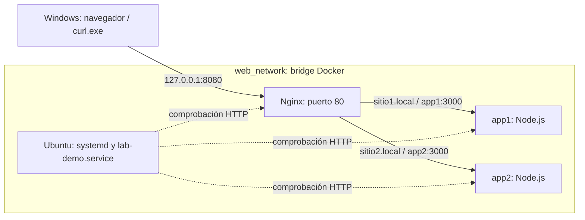

# Fase 2: Docker y Ubuntu Server

## Alcance y arquitectura

Se conservan los servicios `nginx`, `app1`, `app2` y `ubuntu-server` y la red
`web_network`. Nginx y Node.js se ejecutan en sus propios contenedores; Ubuntu
es el entorno de práctica de usuarios, paquetes, red y administración de servicios.
Ubuntu no es el sistema operativo del contenedor de Nginx.



Los nombres `app1`, `app2` y `nginx` se resuelven mediante DNS de Docker.
Las direcciones IP son dinámicas: no deben copiarse a las configuraciones.
`sitio1.local` y `sitio2.local` seleccionan los hosts HTTP y son diferentes de
los nombres de servicio de Docker. La resolución de esos dominios en Windows
se tratará en la fase de hosts virtuales.

`web_network` es una red bridge compartida, **no** una red con `internal: true`.
Tiene puerta de enlace; no se presenta como una red completamente aislada.
Los backends no publican puertos en Windows. El puerto 3000 puede repetirse
porque cada aplicación tiene su propio contenedor.

## Comandos desde PowerShell

Ejecutar en la raíz del repositorio. `exec` ejecuta el comando indicado dentro
del contenedor; `-T` desactiva la terminal interactiva para comprobaciones.

Desde la incorporación de sesiones en [fase 7](07-sesiones-cookies.md), ejecutar
primero `.\scripts\Initialize-Environment.ps1` para crear el entorno local
si no existe. Compose requiere esas variables aunque se consulte otro servicio.

```powershell
docker version
docker compose version
docker compose config -q
docker compose build ubuntu-server
docker compose up -d --no-deps ubuntu-server nginx
docker compose ps -a
docker compose logs --tail 30 ubuntu-server
```

`config -q` valida Compose sin imprimirlo. `build` construye la imagen;
`up -d` aplica la configuración y puede recrear los servicios seleccionados.
No se necesita ejecutar `down`, eliminar volúmenes ni reconstruir los backends.
En una instalación nueva, iniciar los cuatro servicios con
`docker compose up -d --build`.

El puerto publicado es `127.0.0.1:8080:80`: sólo admite acceso local IPv4.
Usar `http://127.0.0.1:8080` evita depender de cómo `localhost` resuelve IPv6.
No permite una demostración desde otro equipo de la LAN.

## Paquetes y usuarios

Se conservaron los paquetes existentes: sudo, curl, nano, vim, iputils-ping,
net-tools, iproute2, procps, systemd y openssh-server. No se añadió un gestor
de monitoreo ni otra herramienta externa. SSH está instalado pero no se
publica su puerto ni se usa para ingresar al laboratorio.

```powershell
docker compose exec -T ubuntu-server cat /etc/os-release
docker compose exec -T ubuntu-server dpkg-query -W sudo curl iproute2 procps systemd
docker compose exec -T ubuntu-server getent group administradores
docker compose exec -T ubuntu-server id ketfer
docker compose exec -T ubuntu-server passwd -S ketfer
docker compose exec -T ubuntu-server stat -c '%a %U %G %n' /home/ketfer
docker compose exec --user ketfer ubuntu-server bash
```

Se mantienen brian, charles, ketfer, marco y adaniel, con pertenencia al grupo
`administradores`. Las cuentas están bloqueadas para autenticación con
contraseña (`L` en `passwd -S`) y sus directorios tienen permisos `700`.
Docker puede iniciar una shell con `--user` sin autenticar por contraseña.
Dentro de esa shell Linux:

```bash
whoami
id
exit
```

Se retiraron las contraseñas comunes del Dockerfile. No se modificó el
historial Git ni se eliminaron imágenes anteriores: versiones antiguas pueden
seguir conteniendo aquella configuración. No reutilizar esas contraseñas.

## Red y conectividad

Desde PowerShell:

```powershell
docker compose exec -T ubuntu-server ip -brief addr
docker compose exec -T ubuntu-server ip route
docker compose exec -T ubuntu-server getent hosts app1 app2 nginx
docker compose exec -T ubuntu-server curl --fail http://app1:3000/
docker compose exec -T ubuntu-server curl --fail http://app2:3000/
docker compose exec -T ubuntu-server curl --fail -H 'Host: sitio1.local' http://nginx/
docker compose exec -T ubuntu-server curl --fail -H 'Host: sitio2.local' http://nginx/
curl.exe -v -H 'Host: sitio1.local' http://127.0.0.1:8080/
curl.exe -v -H 'Host: sitio2.local' http://127.0.0.1:8080/
```

`ip` muestra interfaz y rutas; `getent` demuestra resolución de nombres.
`curl` interno verifica conectividad TCP/HTTP real, no sólo resolución DNS.
Las dos peticiones desde Windows recorren el puerto publicado y el proxy.

## systemd y servicio de práctica

El Dockerfile y Compose arrancan `/lib/systemd/systemd`. No basta con instalar
systemctl: verificar PID 1 y comunicación con el administrador de servicios.

```powershell
docker compose exec -T ubuntu-server ps -p 1 -o comm=
docker compose exec -T ubuntu-server systemctl --version
docker compose exec -T ubuntu-server systemctl is-system-running
docker compose exec -T ubuntu-server systemctl --failed --no-pager
docker compose exec -T ubuntu-server systemctl is-enabled lab-demo.service
docker compose exec -T ubuntu-server systemctl status lab-demo.service --no-pager
```

`lab-demo.service` ejecuta `/usr/local/bin/lab-demo` como ketfer y escribe una
marca de actividad cada diez segundos en el journal. Se habilita al construir
la imagen para arrancar con systemd. Tiene protección del sistema de archivos,
directorio temporal privado y no adquiere privilegios nuevos.

Demostración desde PowerShell con operaciones delegadas al usuario:

```powershell
docker compose exec -T --user ketfer ubuntu-server sudo -n /usr/bin/systemctl stop lab-demo.service
docker compose exec -T ubuntu-server systemctl is-active lab-demo.service
docker compose exec -T --user ketfer ubuntu-server sudo -n /usr/bin/systemctl start lab-demo.service
docker compose exec -T ubuntu-server systemctl is-active lab-demo.service
docker compose exec -T --user ketfer ubuntu-server sudo -n /usr/bin/systemctl restart lab-demo.service
docker compose exec -T ubuntu-server journalctl -u lab-demo.service -n 20 --no-pager
docker compose exec -T --user ketfer ubuntu-server sudo -n -l
```

Después de `stop`, `is-active` devuelve `inactive` y código distinto de cero:
es el resultado esperado. Dejar el servicio activo al terminar.
El grupo sólo puede iniciar, detener y reiniciar esta unidad mediante sudo.
No puede ejecutar comandos arbitrarios como root. La comprobación negativa
`docker compose exec -T --user ketfer ubuntu-server sudo -n /usr/bin/id`
debe fallar. El acceso al propio Docker sigue siendo una capacidad privilegiada.

Compose comprueba `systemctl is-active --quiet lab-demo.service` cada diez
segundos. Una parada prolongada puede cambiar el estado a `unhealthy`;
al iniciarlo se recupera en una comprobación posterior. Esta comprobación
no certifica la salud de todos los servicios del sistema.
`journalctl` consulta los mensajes de la unidad; `docker compose logs`
consulta stdout/stderr del contenedor, por lo que no son intercambiables.
El journal de esta práctica no está respaldado por un volumen persistente.

## Limitaciones y alternativa

`privileged: true` se conserva únicamente en Ubuntu para mantener el entorno
systemd que se comprobó funcionando en Docker Desktop. No se ha demostrado
que sea la configuración mínima necesaria y no es una recomendación de
producción. Los otros tres contenedores no son privilegiados.
El apagado usa `SIGRTMIN+3`, señal prevista para systemd.

Si el docente exige un servidor Ubuntu completo que hospede Nginx y Node.js
en el mismo sistema operativo, la alternativa es una VM Ubuntu en VirtualBox
y desplegar allí el proyecto. La solución actual usa contenedores separados:
no demuestra que Nginx esté instalado o administrado por systemctl en Ubuntu.
En este equipo systemd funciona; no es necesario migrar a una VM para
realizar la práctica actual de servicios.

## Evidencias y fuentes

- [Resultados ejecutados de la fase 2](evidencias/fase-02.md).
- [Bitácora de IA](bitacora-ia.md).
- Docker. (s. f.). [Networking in Compose](https://docs.docker.com/compose/how-tos/networking/).
- Docker. (s. f.). [Define services in Docker Compose](https://docs.docker.com/reference/compose-file/services/).

Las fuentes se consultaron el 8 de octubre de 2026. Las opciones de systemd
y sudo se verificaron con las herramientas instaladas en el contenedor.
