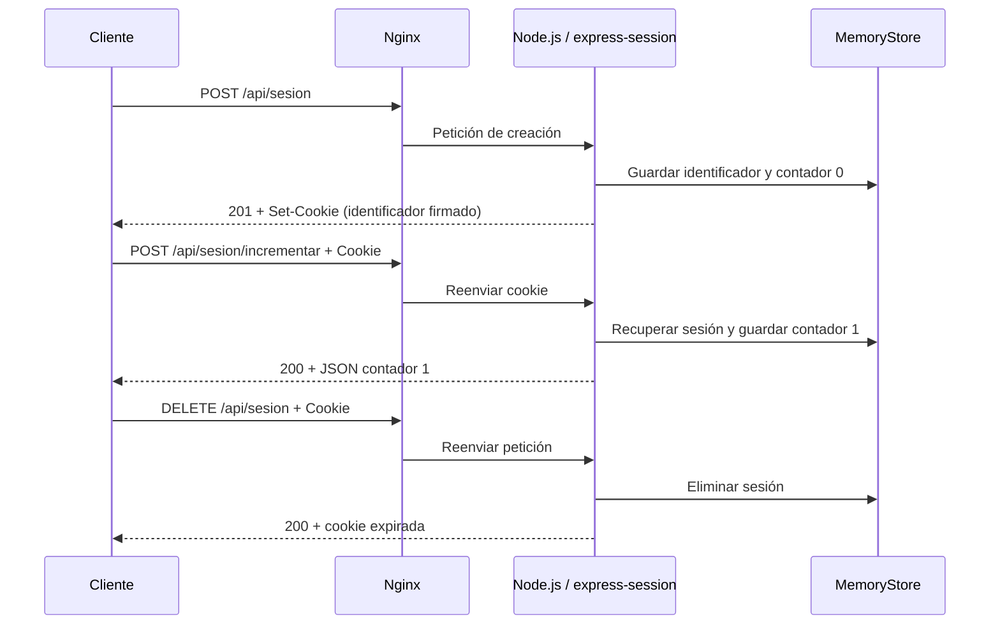

# Fase 7: sesiones y cookies

## Implementación

Los dos backends utilizan express-session 1.19.0, instalado mediante los
package-lock de cada aplicación. La página `/sesiones` ofrece botones para
crear, incrementar, consultar y destruir la sesión. Se añadió un enlace a
esa página desde los HTML iniciales existentes.

| Endpoint | Función | Estado |
|---|---|---|
| GET /api/sesion | Consulta sin crear sesión ni cookie cuando no existe | 200 |
| POST /api/sesion | Crea o regenera sesión y pone contador en 0 | 201 |
| POST /api/sesion/incrementar | Suma 1 al contador de la sesión existente | 200 |
| POST /api/sesion/incrementar sin sesión | Indica que primero se debe crear | 409 |
| DELETE /api/sesion | Destruye datos del servidor y expira la cookie | 200 |

El middleware de sesiones sólo se monta en `/api/sesion`, incluidas sus
subrutas. Las consultas `/health` y las demás APIs no crean sesiones.
Se guardan los cambios antes de enviar la respuesta y se propagan errores
al manejador Express existente. No se devuelve el identificador en el JSON.



La cookie contiene un identificador firmado; el contador está en el servidor.
La firma permite detectar alteraciones del identificador, pero no cifra el
contenido de una cookie. Esta práctica no implementa login ni autorización:
demuestra persistencia de estado entre peticiones HTTP.

## Opciones de sesión

| Opción | Valor y propósito |
|---|---|
| name | app1.sid / app2.sid, diferentes entre aplicaciones |
| secret | SESSION_SECRET, inyectado desde variables de entorno independientes |
| resave | false, evita guardar sin necesidad sesiones no modificadas |
| saveUninitialized | false, evita crear cookie por una consulta inicial |
| httpOnly | true, cookie no accesible mediante document.cookie |
| sameSite | lax, limita el envío en ciertos contextos entre sitios |
| secure | false, compatible con el HTTP local actual |
| path | /, válida para las rutas del mismo host |
| domain | No configurado; cookie limitada al host que la emitió |
| maxAge | 15 minutos; el middleware calcula la expiración |

`trust proxy` continúa desactivado: no se requiere para esta cookie HTTP y
no se utiliza X-Forwarded-For como identidad. Al implantar HTTPS se necesitará
`secure: true` y evaluar confianza exclusivamente en proxies conocidos.
El valor actual no es una configuración de cookies para producción con HTTPS.

`NODE_ENV=production` sigue evitando respuestas de desarrollo del framework;
no implica que el almacenamiento de sesiones de esta práctica sea apto para
producción. MemoryStore sólo sirve para desarrollo y demostración: no es
persistente, no escala entre procesos y no debe usarse como almacén real de
producción. La pérdida de sesiones al reiniciar se comprobó en ambos backends.
No se añadió una base de datos ni Redis porque no hacen falta para la consigna.

## Secretos locales e instalación

Desde PowerShell en la raíz del proyecto:

```powershell
.\scripts\Initialize-Environment.ps1
docker compose config -q
docker compose build app1 app2
docker compose up -d --no-deps --wait --wait-timeout 60 app1 app2
docker compose exec -T nginx nginx -t
```

Sólo tras validar correctamente:

```powershell
docker compose exec -T nginx nginx -s reload
```

El inicializador crea `.env` con dos valores aleatorios independientes de
32 bytes, codificados en base64. Usa un generador criptográfico y no imprime
los valores. No sobrescribe un `.env` existente; se comprobó que ejecutarlo
otra vez mantiene el archivo sin cambios. `.env.example` es una plantilla
vacía que sí se puede versionar. No basta copiarla sin completar sus valores.

Compose convierte APP1_SESSION_SECRET y APP2_SESSION_SECRET en SESSION_SECRET
para cada backend. Se exige que esas variables estén presentes y que cada
secreto tenga al menos 32 caracteres. Se probó que el backend rechaza arrancar
con un secreto vacío, sin afectar los servicios activos.

`.gitignore` excluye `.env` y archivos `*.cookies`; los contextos de build de
los backends tampoco incluyen archivos de entorno. El secreto no se incorpora
mediante COPY o ARG a las imágenes. Se usa `docker compose config -q` porque
la salida completa de config incluiría las variables resueltas.
Un cambio de secreto o un reinicio del proceso puede invalidar las sesiones
existentes; no regenerar `.env` para cada arranque.

## Pruebas automáticas desde PowerShell

```powershell
.\scripts\Test-Sessions.ps1
```

Comprueba creación, atributos de cookie, contador en peticiones posteriores,
aislamiento entre clientes y hosts, rechazo de una cookie alterada, destrucción,
reutilización de cookie antigua y regeneración del identificador. Usa archivos
de cookies temporales que elimina al terminar; no imprime sus valores.

Opción que además reinicia ambos backends por turno y demuestra la pérdida
de datos en memoria y la recuperación saludable:

```powershell
.\scripts\Test-Sessions.ps1 -IncludeRestart
```

Esta opción interrumpe brevemente cada aplicación. Las sesiones de otros
clientes de ese backend también se pierden. La ejecución realizada terminó
con los servicios saludables y destruyó las sesiones de prueba restantes.

## Demostración manual con curl

Desde PowerShell, usar nombres en la URL con `--resolve`, para que curl
asocie las cookies a los hosts correctos. Cambiar únicamente Host sobre una
URL de 127.0.0.1 no equivale a cambiar el dominio que curl asigna a la cookie.

```powershell
$sessionJar = Join-Path $env:TEMP ('infra-sesion-' + [guid]::NewGuid().ToString('N') + '.cookies')

curl.exe --noproxy "*" -v --resolve "sitio1.local:8080:127.0.0.1" -c $sessionJar -X POST http://sitio1.local:8080/api/sesion
curl.exe --noproxy "*" -v --resolve "sitio1.local:8080:127.0.0.1" -b $sessionJar -c $sessionJar -X POST http://sitio1.local:8080/api/sesion/incrementar
curl.exe --noproxy "*" -v --resolve "sitio1.local:8080:127.0.0.1" -b $sessionJar -c $sessionJar http://sitio1.local:8080/api/sesion
curl.exe --noproxy "*" -v --resolve "sitio1.local:8080:127.0.0.1" -b $sessionJar -c $sessionJar -X DELETE http://sitio1.local:8080/api/sesion
curl.exe --noproxy "*" -v --resolve "sitio1.local:8080:127.0.0.1" -b $sessionJar http://sitio1.local:8080/api/sesion
Remove-Item -LiteralPath $sessionJar
```

`-c` guarda cookies recibidas; `-b` las envía. En la consulta posterior al
incremento debe aparecer contador 1. Después de destruir debe aparecer
activa false y contador 0. Repetir con sitio2.local demuestra el segundo host.
Las opciones de cookie son las mismas aunque los nombres sean distintos.

`-v` mostrará el identificador en Set-Cookie y Cookie. Antes de compartir
salidas o capturas, ocultar esos valores; las evidencias guardadas en Markdown
no contienen identificadores reales ni secretos.

## Demostración manual en navegador y DevTools

Configurar primero los nombres en Windows según [fase 3](03-nginx-hosts-virtuales.md).
Abrir `http://sitio1.local:8080/sesiones` y el equivalente de sitio2.local.

1. Abrir DevTools, Network y Application/Storage, sección Cookies.
2. Pulsar Crear sesión: Network mostrará POST y estado 201; la cookie tendrá
   HttpOnly, SameSite Lax y expiración. Secure estará desactivado en HTTP local.
3. Incrementar dos veces: el contador debe llegar a 2.
4. Recargar o Consultar: debe mantenerse en 2 sin crear otra sesión.
5. Abrir sitio2.local: su cookie y contador deben ser independientes.
6. Destruir: Network mostrará DELETE y la cookie se expirará; Consultar debe
   mostrar sesión inactiva. Crear otra sesión comienza en 0.

El JavaScript de la interfaz usa fetch con credenciales same-origin; el
navegador gestiona la cookie sin que el código lea su valor. Estas acciones
interactivas se comprobaron después en Chrome durante la [fase 8](08-pruebas-http-devtools.md),
con capturas reales de las páginas y metadatos obtenidos mediante CDP.
Al cierre de fase 7 sólo se había comprobado HTTP. Después, el usuario confirmó
manualmente creación, incrementos, persistencia, destrucción, nueva sesión e
independencia entre hosts; aportó capturas de Network con estados 201 y 200.
Quedan pendientes conservar esas capturas en el repositorio y completar la
inspección manual de los atributos de cookies en Application.

## Corrección de solicitudes simultáneas

La auditoría detectó pérdida de incrementos cuando varias solicitudes cargaban
el mismo contador antes de guardarlo. Ahora cada backend ordena las modificaciones
por identificador de sesión y lee el contador del almacén dentro de esa cola.
Crear/regenerar y destruir usan la misma cola; un incremento pendiente no puede
guardar de nuevo una sesión destruida. Las colas se eliminan al terminar.

Esta solución corresponde a un proceso por backend con MemoryStore. Un despliegue
con varias réplicas requeriría almacenamiento compartido y operaciones atómicas.
No se añadió Redis ni una base de datos al laboratorio.

```powershell
.\scripts\Test-SessionConcurrency.ps1
```

## Fuentes y evidencias

- [Evidencias ejecutadas de fase 7](evidencias/fase-07.md).
- Express. (s. f.). [Session middleware](https://expressjs.com/en/resources/middleware/session/).
- Express. (s. f.). [Express behind proxies](https://expressjs.com/en/guide/behind-proxies/).
- MDN Web Docs. (s. f.). [Set-Cookie header](https://developer.mozilla.org/en-US/docs/Web/HTTP/Reference/Headers/Set-Cookie).

Consulta: 8 de octubre de 2026.
