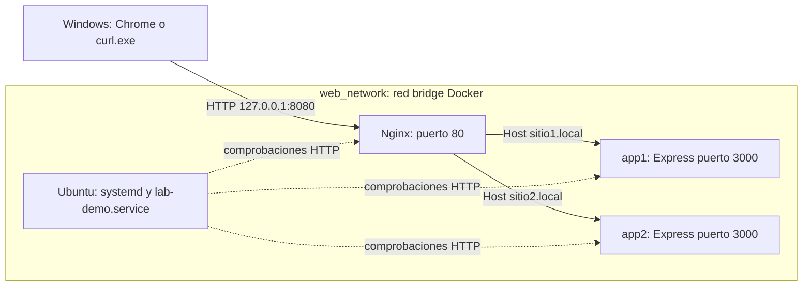

# Guía completa del proyecto Infraestructura-web-DNS

Fecha de elaboración: 8 de octubre de 2026.

Repositorio: [Grupo-Kali-Linuxxxx/Infraestructura-web-DNS](https://github.com/Grupo-Kali-Linuxxxx/Infraestructura-web-DNS).

Esta guía reúne el trabajo realizado, la configuración actual, los comandos
para reproducirlo y los resultados comprobados. Parte del repositorio existente:
se conservaron los nombres de servicios, aplicaciones y hosts virtuales.
GitHub conserva el código; los servicios se ejecutan con Docker en cada equipo.

## 1. Objetivo y resultado

Implementar y demostrar una infraestructura cliente-servidor Linux con dos
hosts virtuales, proxy inverso, backends Node.js, sesiones, cookies y logs.
Ubuntu permite practicar usuarios, paquetes, red y servicios con systemctl.

| Requisito técnico | Implementación realizada |
|---|---|
| Ubuntu Server | Contenedor Ubuntu 24.04 con systemd como PID 1 |
| Usuarios y permisos | Cinco usuarios, grupo administradores, cuentas bloqueadas y hogares 700 |
| Administración de servicios | lab-demo.service, journal y sudo limitado |
| Dos hosts virtuales | sitio1.local y sitio2.local en Nginx |
| Proxy inverso | Nginx hacia app1:3000 y app2:3000 |
| Backend | Express, API JSON, validación y errores controlados |
| Sesiones y cookies | express-session, cookies independientes y controles web |
| Errores personalizados | HTML/CSS para 404 y 502 |
| Logs | Archivos por host y salida Docker |
| Análisis HTTP | curl -v y Chrome DevTools Protocol |
| Auditoría y correcciones | Contador concurrente protegido y montajes Nginx de sólo lectura |

El informe universitario APA y la presentación son entregables separados.
Las capturas de páginas existen; quedan por conservar en el repositorio las
capturas manuales de paneles DevTools y completar la inspección manual de
Application/Cookies y de errores en Network. Las pruebas automáticas de esos
atributos y estados sí se ejecutaron.

## 2. Arquitectura y recorrido de una petición



1. Windows resuelve sitio1.local o sitio2.local a 127.0.0.1 mediante hosts.
2. Docker entrega el puerto 8080 local al puerto 80 de Nginx.
3. Nginx selecciona el bloque server usando Host y server_name.
4. proxy_pass envía la solicitud al backend correspondiente.
5. Express procesa la ruta y devuelve HTML o JSON.
6. Nginx entrega la respuesta y registra el acceso.

Los nombres app1/app2/nginx se resuelven dentro de Docker. Las IP son dinámicas
y no están fijadas en las configuraciones. La red bridge tiene puerta de enlace:
no se configuró internal: true. [Referencia: red de Compose](https://docs.docker.com/compose/how-tos/networking/).

No se instaló un servidor DNS público o autoritativo: se usa DNS de Docker para
servicios internos y hosts de Windows para los nombres locales. Ubuntu es un
contenedor separado; Nginx y Node.js no están instalados dentro de ese Ubuntu.

| Servicio Compose | Contenedor | Acceso |
|---|---|---|
| nginx | web-nginx | 127.0.0.1:8080 hacia puerto 80 |
| app1 | backend-app1 | Puerto 3000 sólo en la red Docker |
| app2 | backend-app2 | Puerto 3000 sólo en la red Docker |
| ubuntu-server | ubuntu-server | docker compose exec; sin puertos publicados |

## 3. Entorno y estructura de archivos

Entorno utilizado: Windows, PowerShell 7, Visual Studio Code y Docker Desktop
con contenedores Linux. Chrome se utiliza para las pruebas de navegador.
No hace falta instalar Node.js ni herramientas de pruebas adicionales en Windows.

Versiones observadas: Docker 29.8.2, Compose 5.5.1, Ubuntu 24.04.5,
Node.js 22.23.3, Express 5.2.1, express-session 1.19.0 y Chrome 154.0.8037.97.
Son resultados de esta sesión; una instalación posterior puede usar otras
versiones de las imágenes base. Los package-lock fijan dependencias de Node.

```text
Infraestructura-web-DNS/
├── backend/
│   ├── app1/   Dockerfile, server.js, package.json, package-lock.json, public/
│   └── app2/   Dockerfile, server.js, package.json, package-lock.json, public/
├── nginx/
│   ├── conf.d/   default.conf, sitio1.conf, sitio2.conf, 00-logging.conf, snippets/
│   └── errors/   404.html, 502.html
├── ubuntu-server/   Dockerfile, administradores.sudoers, lab-demo.service, lab-demo.sh
├── scripts/   inicialización, pruebas y exportación de evidencias
├── docs/   guías, evidencias, ejemplos y bitácora de IA
├── screenshots/   cinco capturas reales y catálogo
├── .env.example
├── .gitattributes
├── .gitignore
├── docker-compose.yml
└── README.md
```

.env y .local-backups/ existen sólo localmente y están excluidos de Git.
.gitattributes conserva finales de línea LF en archivos de texto al clonar
en Windows; las capturas PNG se tratan como archivos binarios.

## 4. Obtener y arrancar el proyecto

Todos los bloques powershell de esta guía se ejecutan en Windows, desde la
raíz del repositorio. docker compose exec ejecuta el comando posterior dentro
del contenedor indicado; -T desactiva la terminal interactiva.

Para obtener una copia en otro equipo, desde una carpeta de trabajo:

```powershell
git clone https://github.com/Grupo-Kali-Linuxxxx/Infraestructura-web-DNS.git
Set-Location .\Infraestructura-web-DNS
```

Para trabajar sobre la copia existente de este equipo:

```powershell
Set-Location -LiteralPath 'C:\Users\Ketfer\Desktop\Actividad 1\Infraestructura-web-DNS'
```

Abrir Docker Desktop y esperar a que el Engine esté funcionando. Después:

```powershell
docker version
docker compose version
.\scripts\Initialize-Environment.ps1
docker compose config -q
docker compose up -d --build --wait --wait-timeout 120
docker compose ps -a
docker compose exec -T nginx nginx -t
```

Initialize-Environment crea .env con dos secretos aleatorios independientes,
sin imprimirlos ni sobrescribir un archivo existente. Compose exige esos valores.
config -q valida la configuración sin mostrar las variables resueltas.
up construye e inicia los cuatro servicios. Nginx espera a que los backends
estén saludables; Ubuntu comprueba que lab-demo.service esté activo.

Resultado esperado: cuatro servicios activos, APP1/APP2 y Ubuntu healthy, y
nginx -t correcto. Los puertos 3000 no deben aparecer publicados en Windows.

### Configurar los nombres del navegador

```powershell
.\scripts\Initialize-LocalHosts.ps1
```

El script añade sólo las entradas ausentes, conserva los bytes anteriores y
guarda un respaldo en .local-backups/. Si detecta una asociación diferente para
uno de los nombres, se detiene para evitar reemplazarla. Windows pide elevación
si hace falta escribir el archivo protegido. Repetirlo no duplica entradas.

```text
127.0.0.1 sitio1.local
127.0.0.1 sitio2.local
```

Abrir [APP1](http://sitio1.local:8080/) y [APP2](http://sitio2.local:8080/).
El acceso usa HTTP local; sólo está publicado en 127.0.0.1 y no en la LAN.

## 5. Ubuntu: usuarios, paquetes, red y systemctl

Se mantuvieron sudo, curl, nano, vim, ping, net-tools, iproute2, procps,
systemd y openssh-server. SSH está instalado, pero su puerto no se publica.
Los usuarios son brian, charles, ketfer, marco y adaniel, todos pertenecientes
a administradores. Se retiraron las contraseñas comunes del Dockerfile.
Sus cuentas tienen contraseña bloqueada y directorios personales con permisos 700.

```powershell
docker compose exec -T ubuntu-server cat /etc/os-release
docker compose exec -T ubuntu-server getent group administradores
docker compose exec -T ubuntu-server id ketfer
docker compose exec -T ubuntu-server passwd -S ketfer
docker compose exec -T ubuntu-server stat -c '%a %U %G %n' /home/ketfer
docker compose exec -T ubuntu-server ip -brief addr
docker compose exec -T ubuntu-server ip route
docker compose exec -T ubuntu-server getent hosts app1 app2 nginx
docker compose exec -T ubuntu-server curl --fail http://app1:3000/health
docker compose exec -T ubuntu-server curl --fail http://app2:3000/health
```

passwd -S muestra L para la contraseña bloqueada. Docker permite iniciar una
shell como ese usuario sin autenticación por contraseña:

```powershell
docker compose exec --user ketfer ubuntu-server bash
```

Dentro de esa shell Linux se pueden ejecutar whoami e id; exit regresa a Windows.

### Servicio real administrado por systemd

```powershell
docker compose exec -T ubuntu-server ps -p 1 -o comm=
docker compose exec -T ubuntu-server systemctl is-system-running
docker compose exec -T ubuntu-server systemctl --failed --no-pager
docker compose exec -T ubuntu-server systemctl status lab-demo.service --no-pager
docker compose exec -T ubuntu-server journalctl -u lab-demo.service -n 20 --no-pager
```

Se comprobó PID 1 systemd, estado running y ninguna unidad fallida.
lab-demo.service ejecuta el script como ketfer y escribe actividad cada diez
segundos. Usa NoNewPrivileges, PrivateTmp, ProtectSystem y ProtectHome.

Los miembros del grupo sólo tienen sudo sin contraseña para start/stop/restart
de esa unidad. La siguiente demostración interrumpe brevemente el servicio:

```powershell
docker compose exec -T --user ketfer ubuntu-server sudo -n /usr/bin/systemctl stop lab-demo.service
docker compose exec -T ubuntu-server systemctl is-active lab-demo.service
docker compose exec -T --user ketfer ubuntu-server sudo -n /usr/bin/systemctl start lab-demo.service
docker compose exec -T --user ketfer ubuntu-server sudo -n /usr/bin/systemctl restart lab-demo.service
docker compose exec -T ubuntu-server systemctl is-active lab-demo.service
```

Después de stop se espera inactive y un código distinto de cero. Al terminar,
debe quedar active. [Archivos y explicación detallada](02-docker-ubuntu.md).

## 6. Nginx: hosts virtuales y proxy

Se conservaron default.conf, sitio1.conf y sitio2.conf. Cada host escucha en
80 y usa su server_name. sitio1.local envía a app1:3000 y sitio2.local a
app2:3000. El servidor por defecto devuelve un diagnóstico simple para nombres
desconocidos. [Referencia: server names de Nginx](https://nginx.org/en/docs/http/server_names.html).

El snippet [proxy-headers.conf](../nginx/conf.d/snippets/proxy-headers.conf)
centraliza esta configuración:

```nginx
proxy_http_version 1.1;
proxy_set_header Connection "";
proxy_connect_timeout 3s;
proxy_send_timeout 30s;
proxy_read_timeout 30s;
proxy_set_header Host $host;
proxy_set_header X-Real-IP $remote_addr;
proxy_set_header X-Forwarded-For $proxy_add_x_forwarded_for;
proxy_set_header X-Forwarded-Proto $scheme;
```

Host conserva el nombre normalizado del sitio. X-Real-IP refleja el cliente
visto por Nginx y X-Forwarded-Proto el protocolo utilizado. X-Forwarded-For
añade esa IP a la cadena recibida; sus valores iniciales pueden venir del
cliente y no se usan como prueba de identidad. El diagnóstico distingue la
IP inmediata de Nginx de la IP de cliente reenviada.

La ubicación /api/ conserva los errores JSON del backend mediante
proxy_intercept_errors off. Fuera de ella se interceptan 404/502 para servir
HTML propio. Los fallos generados por el propio Nginx pueden ser HTML también
en API. Ambos montajes Nginx tienen :ro; sólo Windows modifica esos archivos.

Antes de recargar una configuración modificada:

```powershell
docker compose exec -T nginx nginx -t
```

Sólo si pasa la validación:

```powershell
docker compose exec -T nginx nginx -s reload
```

La recarga también renueva la resolución de upstreams después de recrear
backends y cambiar sus IP. [Guía detallada de hosts](03-nginx-hosts-virtuales.md).

## 7. Páginas de error y logs

Se implementaron [404.html](../nginx/errors/404.html), con diseño azul, y
[502.html](../nginx/errors/502.html), con diseño ámbar. Las ubicaciones /errors/
son internas o devuelven 404; no exponen los archivos como páginas normales.
El código de estado original se conserva al mostrar el HTML personalizado.

| URL | Resultado esperado |
|---|---|
| http://sitio1.local:8080/no-existe | 404, Recurso no disponible |
| http://sitio1.local:8080/pruebas/502 | 502, Servicio temporalmente no disponible |
| http://sitio2.local:8080/no-existe | 404 personalizado del segundo host |
| http://sitio2.local:8080/pruebas/502 | 502 personalizado del segundo host |

/pruebas/502 cierra deliberadamente el socket del backend para generar un
502 real en Nginx sin detener el contenedor. En pruebas de parada de contenedor
se observó 504 por timeout: no se cambió artificialmente ese código a 502.

El access log registra cada petición con fecha, IP, host, método, ruta,
estado, bytes, upstream y duración. El error log explica fallos, como el
cierre prematuro del upstream. Un 404 del backend puede aparecer sólo en acceso.
Cada sitio tiene archivos independientes y copias hacia stdout/stderr Docker.

```powershell
docker compose logs --tail 30 nginx
docker compose exec -T nginx tail -n 20 /var/log/nginx/sitio1_access.log
docker compose exec -T nginx tail -n 20 /var/log/nginx/sitio1_error.log
docker compose exec -T nginx tail -n 20 /var/log/nginx/sitio2_access.log
docker compose exec -T nginx tail -n 20 /var/log/nginx/sitio2_error.log
```

No se registran cookies ni cuerpos de petición. Las rutas y query strings sí
se registran. Los archivos internos y el journal no tienen volumen persistente;
guardar extractos antes de recrear los contenedores si se necesitan evidencias.
[Guía de errores](04-paginas-error.md) y [guía de logs](05-logs-nginx.md).

## 8. Backends Express y API

Cada backend tiene package.json y package-lock.json. Su Dockerfile usa
npm ci, excluye archivos locales del contexto, copia server.js/public y ejecuta
como node. NODE_ENV es production para el manejo de errores del framework;
el conjunto de la infraestructura sigue siendo un laboratorio.

| Método | Ruta | Comportamiento |
|---|---|---|
| GET | / | Identifica Backend App 1 o Backend App 2 |
| GET | /health | Estado ok, utilizado por healthcheck |
| GET | /diagnostico | Método, ruta y cabeceras seleccionadas del proxy |
| GET | /sesiones | Interfaz web con cuatro controles |
| GET | /api/info | Identificación y tecnología de la aplicación |
| POST | /api/eco | Devuelve mensaje validado y recortado |
| GET | /api/pruebas/error | Error asíncrono controlado, JSON 500 |
| GET | /pruebas/502 | Cierre de conexión de prueba |

express.json limita el cuerpo a 8 KB. /api/eco exige un objeto JSON con mensaje
de texto no vacío y hasta 200 caracteres. Los errores controlados incluyen
400, 404, 405 con Allow: POST, 413, 415 y 500. No se muestran stacks ni secretos.
Al recibir SIGTERM, cada proceso intenta cerrar conexiones y salir en ocho segundos.

```powershell
curl.exe --noproxy "*" http://sitio1.local:8080/health
curl.exe --noproxy "*" http://sitio2.local:8080/api/info
curl.exe --noproxy "*" -H "Content-Type: application/json" --data-binary "@docs/ejemplos/eco.json" http://sitio1.local:8080/api/eco
docker compose exec -T app1 npm run check
docker compose exec -T app2 npm run check
```

[Guía detallada de Express](06-backends-express.md).

## 9. Sesiones, cookies e interfaz

express-session guarda el estado en el servidor y envía al cliente un
identificador firmado. Las cookies se llaman app1.sid y app2.sid, sin Domain
compartido, con Path=/, HttpOnly, SameSite Lax y duración de 15 minutos.
Secure está desactivado porque esta implementación usa HTTP local.
[Referencia: express-session](https://expressjs.com/en/resources/middleware/session/).

Cada aplicación exige SESSION_SECRET de al menos 32 caracteres, obtenido de
APP1_SESSION_SECRET o APP2_SESSION_SECRET en .env. saveUninitialized=false
evita crear cookies al consultar sin sesión; resave=false evita guardados
innecesarios. MemoryStore mantiene datos sólo en el proceso actual.

| Método y ruta | Estado y efecto |
|---|---|
| GET /api/sesion | 200, estado actual; no crea sesión al inicio |
| POST /api/sesion | 201, regenera identificador y contador 0 |
| POST /api/sesion/incrementar | 200, aumenta contador; 409 si no hay sesión activa |
| DELETE /api/sesion | 200, destruye datos y expira cookie |

En [APP1/sesiones](http://sitio1.local:8080/sesiones), Crear sesión inicia el
contador; Incrementar lo aumenta; Consultar recupera el estado; Destruir
sesión vuelve a inactiva y 0. Recargar conserva el contador mientras la sesión
siga vigente. APP2 mantiene otro contador. La interfaz usa fetch same-origin;
document.cookie no puede leer las cookies HttpOnly.

### Corrección del contador concurrente

La auditoría encontró 40 respuestas 200 con contador final 37 en APP1.
Una prueba con solicitudes en el mismo bloque TCP reprodujo contadores 1 y 2
en ambos backends antes de corregirlos. Varias solicitudes cargaban el mismo
estado y guardaban valores que sobrescribían incrementos previos.

Se añadió una cola por identificador de sesión para las modificaciones.
El incremento consulta el estado persistido dentro de la cola y guarda antes
de continuar con la siguiente solicitud. Crear/regenerar y destruir usan la
misma coordinación. Las colas se eliminan al terminar, incluso ante errores.
Un incremento pendiente sobre una sesión destruida devuelve 409.

La prueba posterior conservó los 40 incrementos en ambos hosts, sin contadores
duplicados, tanto directamente como por Nginx. También comprobó destrucción
y regeneración seguidas de incrementos pendientes. Esta coordinación corresponde
a un proceso por backend; varias réplicas necesitarían operaciones atómicas
en un almacén compartido. [Evidencias de corrección](evidencias/correcciones-auditoria.md).

## 10. Análisis HTTP con curl y DevTools

```powershell
curl.exe -v --noproxy "*" http://sitio1.local:8080/diagnostico
curl.exe -v --noproxy "*" http://sitio2.local:8080/diagnostico
.\scripts\Export-HttpEvidence.ps1
```

En curl -v, > indica datos enviados, < recibidos y * diagnósticos de conexión.
Host selecciona el sitio; el estado HTTP indica el resultado; Content-Type
describe el cuerpo; Cache-Control no-store evita almacenarlo. Set-Cookie
establece la cookie y Cookie la devuelve en peticiones posteriores. Los
cookie jars de las pruebas permiten conservarla entre comandos.
[Referencia: manual de curl](https://curl.se/docs/manpage.html).

Si Windows todavía no reconoce los nombres, probar sin modificar el sistema:

```powershell
curl.exe -v --noproxy "*" --resolve sitio1.local:8080:127.0.0.1 http://sitio1.local:8080/
curl.exe -v --noproxy "*" --resolve sitio2.local:8080:127.0.0.1 http://sitio2.local:8080/
```

--resolve sólo cambia esa ejecución de curl. El exportador ejecuta 22 solicitudes
y guarda cabeceras seleccionadas y resultados con valores de cookies omitidos.
La salida verbose manual puede mostrar identificadores: ocultarlos al compartirla.

### Revisión manual en Chrome

1. Abrir /sesiones, pulsar F12 y seleccionar Network.
2. Activar Keep log/Preserve log y pulsar Crear sesión: POST, estado 201.
3. Seleccionar esa fila; Headers muestra cabeceras y Response el JSON.
4. Incrementar dos veces: dos respuestas 200 y contador 2. Recargar conserva 2.
5. En Application, Storage, Cookies, seleccionar el sitio: comprobar nombre,
   HttpOnly, SameSite Lax, Path y expiración. Ocultar la columna del valor.
6. Crear otra sesión en APP2 y llevarla a 1; APP1 debe conservar 2 al consultar.
7. Destruir en APP1: sesión inactiva, contador 0 y cookie eliminada.
8. Abrir /no-existe y /pruebas/502: comprobar 404/502 en Network y las páginas propias.

El usuario ya confirmó manualmente persistencia, destrucción, nueva sesión e
independencia entre sitios y aportó capturas de Network con 201 y 200.
Un favicon.ico inexistente puede producir otro 404; no cambia el estado de
las peticiones de sesiones ni demuestra un fallo de esas funciones.

### Navegador automatizado real

```powershell
.\scripts\Test-Browser.ps1 -UseSystemResolution
```

El script usa Chrome con perfil temporal, hace clic en controles reales,
consulta Network/Cookies mediante CDP y captura páginas a 1280 × 900.
Después cierra su navegador y elimina su perfil temporal. Sin el parámetro
usa reglas de resolución sólo dentro de ese Chrome. No usa el perfil personal.
Las capturas son de páginas; los metadatos HTTP están en browser-fase-08.json.
[Guía detallada de HTTP](08-pruebas-http-devtools.md).

## 11. Ejecutar las pruebas y consultar evidencias

```powershell
.\scripts\Test-VirtualHosts.ps1
.\scripts\Test-ErrorPages.ps1
.\scripts\Test-NginxLogs.ps1
.\scripts\Test-Backends.ps1
.\scripts\Test-Sessions.ps1
.\scripts\Test-SessionConcurrency.ps1
.\scripts\Test-Browser.ps1 -UseSystemResolution
```

| Script | Qué verifica |
|---|---|
| Test-VirtualHosts | Dos sitios, upstream, ruta, cabeceras y servidor por defecto |
| Test-ErrorPages | Estados y HTML 404/502, caché y ubicaciones internas |
| Test-NginxLogs | Accesos 200/404/502, campos, causa del 502 y salida Docker |
| Test-Backends | Health, info, eco, validación y errores JSON |
| Test-Sessions | Ciclo completo, firma, aislamiento, regeneración y cookie expirada |
| Test-SessionConcurrency | 40 incrementos sin pérdidas y protección tras destruir/regenerar |
| Test-Browser | Controles reales, contadores, cookies, navegación y códigos HTTP |

Los scripts deben terminar con PASS. Si aparece un error, investigar antes de
considerar correcta la ejecución. Los clientes de prueba no publican cookies
y destruyen sus sesiones. La prueba de concurrencia usa Node del contenedor,
sin paquetes adicionales.

Opciones adicionales que interrumpen brevemente servicios:

```powershell
.\scripts\Test-ErrorPages.ps1 -IncludeBackendFailure
.\scripts\Test-Sessions.ps1 -IncludeRestart
```

La primera para y restaura backends para comprobar el otro host y la recuperación.
La segunda demuestra la pérdida de sesiones al reiniciar MemoryStore. Las
paradas y reinicios de demostración ya se comprobaron en fases anteriores.

Evidencias disponibles:

- [Fase 2](evidencias/fase-02.md), [fase 3](evidencias/fase-03.md),
  [fase 4](evidencias/fase-04.md), [fase 5](evidencias/fase-05.md),
  [fase 6](evidencias/fase-06.md), [fase 7](evidencias/fase-07.md) y
  [fase 8](evidencias/fase-08.md).
- [Extractos curl](evidencias/curl-fase-08.md) y
  [registro real de Chrome](evidencias/browser-fase-08.json).
- [Auditoría y correcciones](evidencias/correcciones-auditoria.md).
- [Catálogo de capturas](../screenshots/README.md).
- [Bitácora verídica del uso de IA](bitacora-ia.md).
- [Comparación con los documentos del compañero](referencias/aporte-companero.md).

La auditoría también comprobó código local igual al ejecutado, sintaxis de
scripts y JavaScript, ausencia de secretos locales en archivos publicables,
permisos sudo y dependencias instaladas. npm audit reportó cero vulnerabilidades
en ambos backends; ese análisis cubre dependencias npm, no las imágenes base.

## 12. Mantenimiento y solución de problemas

| Síntoma | Comprobación y acción |
|---|---|
| Docker Engine no responde | Abrir Docker Desktop, esperar Engine y repetir docker version |
| Compose exige SESSION_SECRET | Ejecutar Initialize-Environment; comprobar .env sin mostrar sus valores |
| Puerto 8080 ocupado | Consultar Get-NetTCPConnection -LocalPort 8080; identificar el proceso antes de actuar |
| Nombre local no resuelve | Ejecutar Initialize-LocalHosts o usar curl --resolve |
| localhost falla pero 127.0.0.1 funciona | Usar IPv4 127.0.0.1; el puerto está publicado sólo en esa dirección |
| Responde el diagnóstico de Nginx | Comprobar URL/Host sitio1.local o sitio2.local |
| 502 fuera de la ruta de prueba | Revisar estado de backends, logs y resolución upstream; validar y recargar Nginx |
| 504 al parar un backend | Timeout observado; restaurar backend y comprobar /health |
| Contador volvió a 0 | Comprobar destrucción, expiración o reinicio; MemoryStore no persiste |
| systemctl no comunica con el sistema | Revisar PID 1, logs de Ubuntu y que el servicio Compose use systemd |
| Falla el navegador de pruebas | Usar PowerShell 7 y comprobar Chrome en la ruta que indica el script |

Después de modificar código de un backend, construir y aplicar:

```powershell
docker compose build app1 app2
docker compose up -d --no-deps --wait --wait-timeout 60 app1 app2
docker compose exec -T nginx nginx -t
```

Si nginx -t pasa, recargar para resolver los upstreams actuales:

```powershell
docker compose exec -T nginx nginx -s reload
```

Para una pausa del laboratorio que detenga todos los servicios:

```powershell
docker compose stop
```

Para retomarlo:

```powershell
docker compose up -d --wait --wait-timeout 120
```

El reinicio de procesos pierde las sesiones en memoria. No hace falta borrar
imágenes, volúmenes ni archivos para estas operaciones.

## 13. Seguridad, límites y publicación

- .env, cookies temporales, logs y respaldos del archivo hosts están excluidos.
  .env.example contiene nombres de variables sin secretos. Cada equipo genera
  su propio .env al instalar; no copiar los secretos de otra persona.
- Nginx sólo publica IPv4 local y sus configuraciones/páginas están en modo lectura.
- Los backends corren como node. Ubuntu conserva privileged para el laboratorio
  systemd comprobado; no se presenta como una configuración de producción.
- Las cookies usan HTTP local y MemoryStore. HTTPS, persistencia de sesiones y
  escalado con varias réplicas necesitarían un diseño adicional.
- Las imágenes base usan etiquetas actualizables; los locks fijan dependencias
  de Node, pero no congelan todas las futuras versiones del sistema operativo.
- No hay persistencia ni rotación configurada para archivos internos de logs.
- Las rutas que provocan 502/500 son demostraciones académicas deliberadas.
- Las contraseñas retiradas de Dockerfiles antiguos pueden seguir en el historial
  existente: no reutilizarlas. No se reescribió el historial de Git.

Para colaborar mediante Git, revisar siempre el contenido antes del commit:

```powershell
git status --short
git diff --check
git check-ignore .env .local-backups/ prueba.cookies
```

La publicación debe incluir código, configuraciones, scripts, locks, guías y
evidencias sanitizadas. El historial de las fases conserva lo observado en
cada momento, incluidas las pruebas fallidas y las correcciones posteriores.
La bitácora distingue autorizaciones del usuario, pruebas automáticas y
confirmaciones manuales; no se atribuye aceptación formal que no haya ocurrido.
